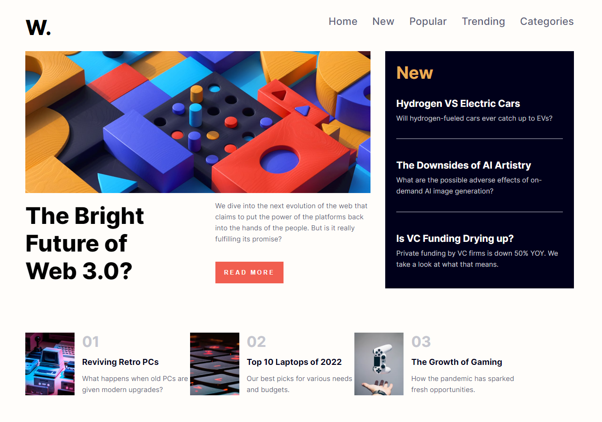

# Frontend Mentor - News homepage solution

This is a solution to the [News homepage challenge on Frontend Mentor](https://www.frontendmentor.io/challenges/news-homepage-H6SWTa1MFl). Frontend Mentor challenges help you improve your coding skills by building realistic projects. 

## Overview

### The challenge

Users should be able to:

- View the optimal layout for the interface depending on their device's screen size
- See hover and focus states for all interactive elements on the page

### Design:

### Screenshot

### Links

- Solution URL: [Solution](./solution)
- Live Site URL: [Live site](https://verdant-empanada-97e9f2.netlify.app/)

## My process

### Built with

- [React](https://reactjs.org/) - JS library
- Flexbox
- CSS Grid
- Mobile-first workflow
- Semantic HTML5 markup

## Author

- LinkedIn - [Daniel Westerlund](https://www.linkedin.com/in/daniel-westerlund-a07529179/)
- Website - [GitHub Pages](https://danielw720.github.io/)
- Frontend Mentor - [@DanielW720](https://www.frontendmentor.io/profile/yourusername)
